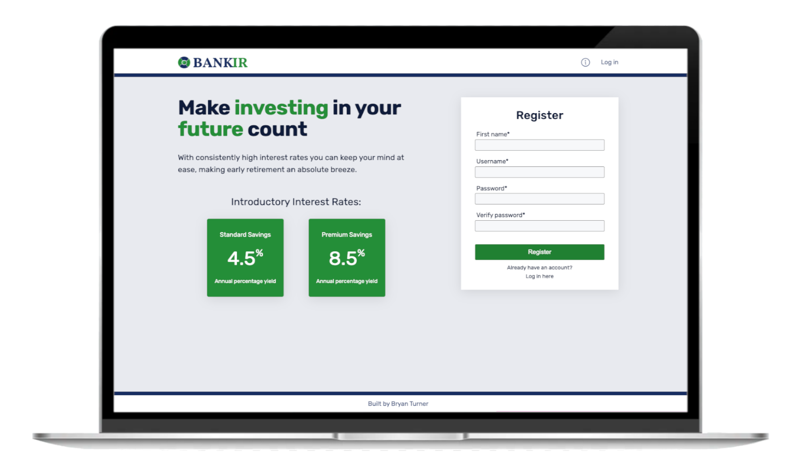

# BankIR Simulated Banking Front-end

Users can register and log in with personal accounts. They can practice making transactions, transfers and earning interest for educational purposes. To view the back-end code used for this project, click [here](https://github.com/bryturner/bankir-be)

## Technologies

- React
- JavaScript
- React-testing-library
- Jest
- Styled-components
- CSS

## Possible Features

- Restrict users from making multiple transactions/transfers at the same time on different devices. MongoDB provides this service, but it is above the tier I’m using.
- Automatically update the accounts every month by adding earned interest
- Enabling users to set up automatic transfers/transactions

## Author

**Bryan Turner**

- [My LinkedIn Profile](https://www.linkedin.com/in/bryanturnerdev/)
